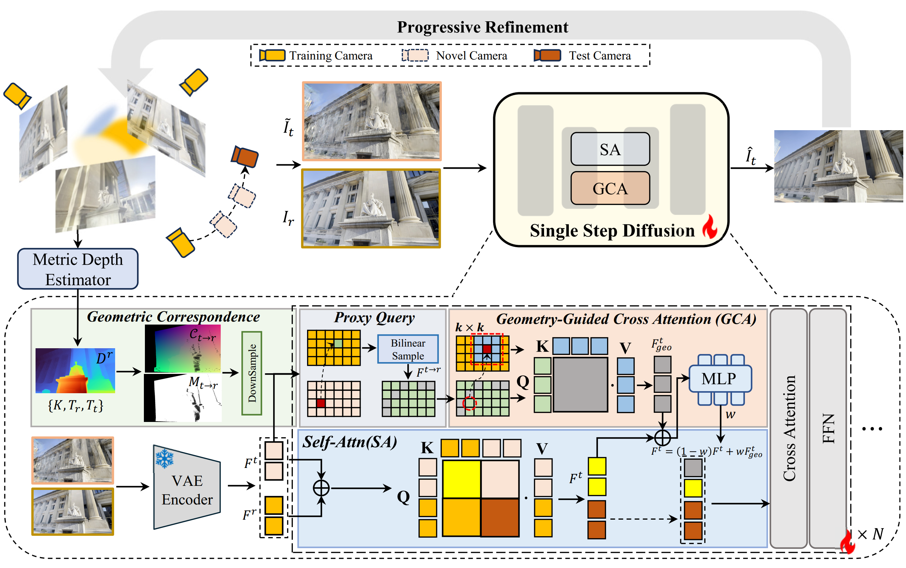

<h1 align="center">GeoQuery: Geometry-Query Diffusion for Sparse-View Reconstruction</h1>

<p align="center">
  <a href="https://xiaoc7.github.io/">Xiao Cao</a>,
  Yuze Li,
  <a href="https://youmi-zym.github.io/">Youmin Zhang</a>,
  Jiayu Song,
  <a href="https://yancheng-tju.github.io/yancheng.github.io/">Cheng Yan</a>,
  <a href="https://scholar.google.com/citations?user=yjG4Eg4AAAAJ&hl=en">Wen Li</a>,
  <a href="https://scholar.google.com/citations?user=inRIcS0AAAAJ&hl=en">Lixin Duan</a>
</p>


<hr>

<div align="center">
  <b>Accepted by SIGGRAPH 2026</b> (Conference Track)<br>
  <a href="https://s2026.siggraph.org/">SIGGRAPH 2026</a>
</div>

<br>

<div align="center">
  <a href="https://xiaoc7.github.io/GeoQuery"></a>
  &nbsp;
  <a href="https://arxiv.org/abs/2605.12399"></a>
  &nbsp;
  <a href="https://huggingface.co/DIG-UESTC/GeoQuery"></a>
</div>

<br>

<p align="center">

  ✨ Your star means a lot to us! Please give it a star if you find it helpful. 🌟

</p>

## News

- 🎉 **2026-4-30** — Our paper **GeoQuery** has been **accepted to SIGGRAPH 2026** (Conference Track). See the [arXiv preprint](https://arxiv.org/abs/2605.12399) ([DOI](https://doi.org/10.48550/arXiv.2605.12399)).
- ✅ **2026-5-27** — Official training and gsplat integration code is released.

---

## Pretrained Weights


| Model                      | Description                                                                                   | Link                                                   |
| -------------------------- | --------------------------------------------------------------------------------------------- | ------------------------------------------------------ |
| GeoQuery diffusion refiner | Checkpoint for GeoQuery image restoration and gsplat integration. Use with `--geoquery_ckpt`. | [Hugging Face](https://huggingface.co/DIG-UESTC/GeoQuery) |


---

## Overview

GeoQuery improves rendered novel views by querying **geometry-aligned reference features** inside a single-step diffusion image restoration model, and can be plugged into sparse-view 3D Gaussian Splatting pipelines.

### Method Pipeline

<p align="center">
  
</p>

<p align="center"><i>
Starting from a sparse training set, we optimize 3DGS and progressively refine it through iterative rendering and supervision updates.
At each step, 3DGS produces an artifact-prone rendering; we estimate metric depth to build a geometric correspondence field.
Geometry-Guided Cross-View Attention (GCA) retrieves proxy features from the reference view within a local neighborhood,
and adaptive fusion integrates geometry-guided evidence into the diffusion backbone.
The restored output serves as a pseudo-observation for subsequent 3DGS refinement.
</i></p>

### Repository Structure


| Component          | Path                               | Description                          |
| ------------------ | ---------------------------------- | ------------------------------------ |
| GeoQuery model     | `src/model.py`                     | Model definition and inference       |
| Diffusion training | `src/train_geoquery.py`            | Train the GeoQuery refiner           |
| GCA                | `src/geometry_guided_attention.py` | Geometry-Guided Cross-View Attention |
| AFF                | `src/adaptive_feature_fusion.py`   | Adaptive fusion (self-attn + GCA)    |
| Correspondence     | `src/geometry_utils.py`            | Geometric correspondence field       |
| 3DGS example       | `examples_geoquery/gsplat/`        | Iterative gsplat + GeoQuery          |


---

## Installation

```bash
conda create -n geoquery python=3.10.16
conda activate geoquery
pip install -r requirements.txt
```

For the gsplat example:

```bash
pip install -r examples_geoquery/gsplat/requirements.txt
```

---

## Training GeoQuery

### Data Preparation

GeoQuery training uses paired rendered/target images and a geometry reference
view. Each sample contains:

- `image`: the degraded/rendered target-view image used as input.
- `target_image`: the clean target-view supervision image.
- `ref_image`: a clean reference-view image from the same scene.
- `ref_depth`: metric depth for `ref_image`, stored as `.pfm`.
- `ref_depth_confidence`: a confidence map for `ref_depth`, stored as `.npy`.
- `prompt`: the text prompt for the one-step diffusion refiner.

The reference depth can be produced by any accurate depth or MVS estimator. In
our pipeline, `ref_depth` can be prepared with methods such as **MVSFormer++**
or **Depth Anything 3**. The depth should be in the reference camera coordinate
system and should be geometrically aligned with `ref_image`. Confidence values
are expected in `[0, 100]`; `--conf_threshold` is applied after dividing the
confidence map by `100`.

The training script also needs COLMAP cameras and poses for each scene through
`--gt_colmap`. The expected layout is:

```text
path/to/colmap_root/
  scene_name/
    gaussian_splat/
      sparse/
        0/
          cameras.bin
          images.bin
```

Prepare a JSON dataset with `train` / `test` splits:

```json
{
  "train": {
    "sample_id": {
      "image": "path/to/source.png",
      "target_image": "path/to/target.png",
      "ref_image": "path/to/reference.png",
      "ref_depth": "path/to/reference_depth.pfm",
      "ref_depth_confidence": "path/to/reference_confidence.npy",
      "prompt": "remove degradation"
    }
  },
  "test": {...}
}
```
Train GeoQuery (or use `train_geoquery_diffusion.sh`):

```bash
CUDA_VISIBLE_DEVICES=${CUDA_VISIBLE_DEVICES:-0} accelerate launch src/train_geoquery.py \
    --mixed_precision=bf16 \
    --output_dir="${OUTPUT_DIR:-outputs/geoquery}" \
    --dataset_path="${DATASET_JSON:-path/to/dataset.json}" \
    --max_train_steps 100005 \
    --learning_rate 2e-5 \
    --input_mode "resize" \
    --train_batch_size=1 --dataloader_num_workers 8 \
    --enable_xformers_memory_efficient_attention \
    --checkpointing_steps=20000 --eval_freq 20000 --viz_freq 2000 \
    --lambda_lpips 1.0 --lambda_l2 1.0 --lambda_gram 0.5 --gram_loss_warmup_steps 5000 \
    --report_to "wandb" --tracker_project_name "${WANDB_PROJECT:-geoquery}" \
    --tracker_run_name "${WANDB_RUN_NAME:-geoquery_train}" --timestep 199 \
    --gt_colmap "${GTCOLMAP_ROOT:-path/to/colmap_root}" \
    --conf_threshold 0.0 \
    --neighborhood_size 3 \
    --low_res_only
```

Resume from checkpoint:

```bash
  --resume path/to/checkpoints/model_100001.pkl
```

---

## GeoQuery + 3D Gaussian Splatting

Apply GeoQuery during iterative 3DGS updates (`run_geoquery_gsplat.sh`):

```bash
CUDA_VISIBLE_DEVICES=0 python examples_geoquery/gsplat/train_geoquery_gsplat.py default \
  --data_dir path/to/scene \
  --data_factor 4 \
  --result_dir outputs/geoquery_gsplat/scene \
  --ckpt path/to/3dgs_checkpoint.pt \
  --geoquery_ckpt path/to/geoquery_checkpoint.pkl \
  --n_views 9 \
  --dataset_type mipnerf360 \
  --no-normalize-world-space \
  --low_res_only \
  --window_size 3 \
  --depth_dir path/to/reference_depths
```

`--window_size` should match `--neighborhood_size` used in diffusion training.

### 3DGS Reference Depth Layout

The gsplat integration does not estimate stereo depth on the fly. It reads
precomputed reference depths from `--depth_dir`. Depth maps should be stored as
`.npy` files with the same base name as the training image, without the image
extension:

```text
path/to/reference_depths/
  mipnerf360/
    garden/
      9_views/
        depth/
          _DSC8681.npy
          _DSC8682.npy
        confidence/
          _DSC8681.npy
          _DSC8682.npy
```

The general path rule is:

```text
{depth_dir}/{dataset_type}/{scene_name}/{n_views}_views/depth/{image_base}.npy
```

where:

- `dataset_type` is the value passed by `--dataset_type` (`mipnerf360` or
`dl3dv`; `auto` infers it from `--data_dir`).
- `scene_name` is `basename(data_dir)` for Mip-NeRF 360 scenes. For DL3DV-style
paths ending in `gaussian_splat`, it is the parent directory name.
- `n_views` must match the `--n_views` argument.
- `image_base` is the training image filename without extension.

The current gsplat loader uses the files in `depth/`; the optional
`confidence/` folder is kept for consistency with common MVS/Depth Anything
outputs.

## Acknowledgements

We gratefully acknowledge the projects and datasets that helped make GeoQuery
possible, including [MVSFormer++](https://github.com/maybeLx/MVSFormerPlusPlus),
[Depth Anything 3](https://github.com/ByteDance-Seed/Depth-Anything-3),
[DIFIX3D+](https://arxiv.org/abs/2503.01774),
[gsplat](https://github.com/nerfstudio-project/gsplat),
[DL3DV-10K](https://dl3dv-10k.github.io/DL3DV-10K/), and
[Mip-NeRF 360](https://jonbarron.info/mipnerf360/).

---

## Citation

If you find this work useful, please cite:

```bibtex
@misc{cao2026geoquery,
      title={GeoQuery: Geometry-Query Diffusion for Sparse-View Reconstruction},
      author={Xiao Cao and Yuze Li and Youmin Zhang and Jiayu Song and Cheng Yan and Wen Li and Lixin Duan},
      year={2026},
      eprint={2605.12399},
      archivePrefix={arXiv},
      primaryClass={cs.CV},
      url={https://arxiv.org/abs/2605.12399},
}
```
